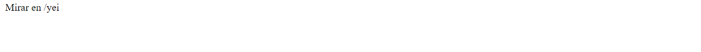
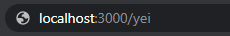
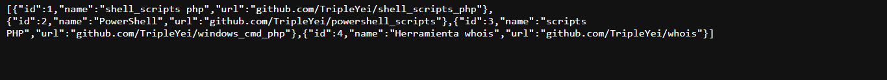

# api_express
Crear API con Express, donde el JSON pongo artículos del blog.

## Uso

~~~~
node web.js
~~~~

## Navegador

~~~~
localhost:3000
~~~~

## Proceso 

Nada más entrar,vemos lo siguiente

En la url

Vemos el siguiente JSON

